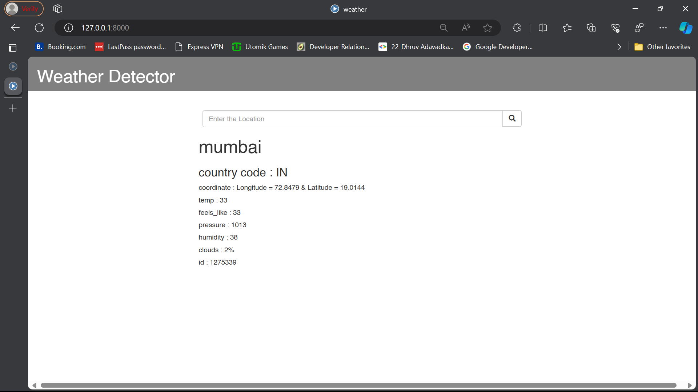
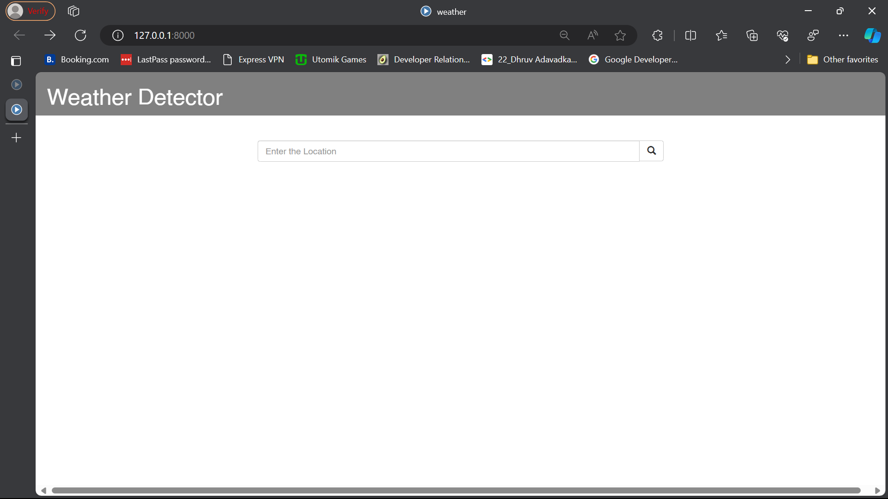

# Weather-Application

## Overview

The Django Weather Application is a simple web application that provides weather information based on user-provided city names. It utilizes the OpenWeatherMap API to retrieve real-time weather data.

## Features

- **City Weather Information:** Get current weather details for a specific city.
- **OpenWeatherMap API Integration:** Utilizes the OpenWeatherMap API for accurate and up-to-date weather data.
- **Django Project Structure:** Organized Django project structure with a dedicated app named 'myapp.'

## Screenshots

Include screenshots of the key features to provide a visual representation of your project.

1. **Weather Information:**
   

2. **Weather Information:**
   

3. **City Input Form:**
   


## Prerequisites

- Python 3.x
- Django 4.0.1
- OpenWeatherMap API Key (replace `<your-api-key>` in your views with your actual API key)

## Installation

1. **Clone the repository:**

   ```bash
   git clone https://github.com/your-username/django-weather.git

2. **Apply migrations:**

   ```bash
      python manage.py migrate

3. **Run the development server:**

   ```bash
      python manage.py runserver
   
3. **Open the application in your browser:**

http://localhost:8000/

## Configuration
### API Key:
Replace <your-api-key> with your actual OpenWeatherMap API key in the views.

## Usage
Enter a city name in the input form.
Get instant weather information!

## Contributing
If you'd like to contribute to this project, please follow our Contribution Guidelines.

## License
This project is licensed under the MIT License.

## Acknowledgments
Special thanks to Django for the web framework.
Weather data provided by OpenWeatherMap.
